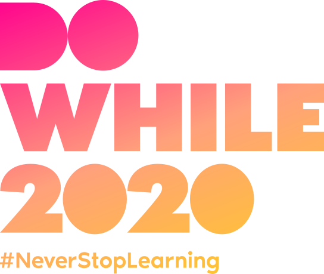
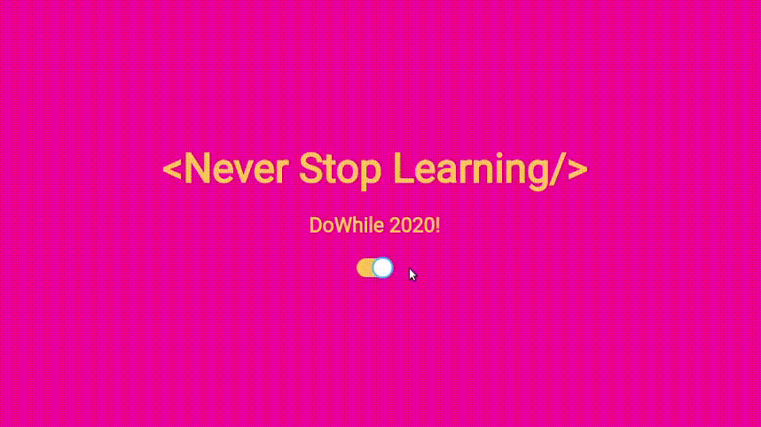

## :wink: Never Stop Learning

Esse foi o lema principal do evento DoWhile 2020 e, para reforçar a ideia de que o aprendizado deve ser contínuo, preparei esse theme switcher temático do evento!

Ele foi desenvolvido tendo como base a introdução à biblioteca styled-components, pela Helena Strada, bem como de um aprofundamento desse conteúdo dentro do canal da rocket!

### :sunglasses: Os conhecimentos aplicados foram

- aplicação de estilos com styled-components
- definição de temas globais
- troca dinâmica desses temas, usando react hooks

### :exploding_head: Preview

## 📝 Licença
Esse projeto se encontra sob a licença **MIT**. Para mais informações, acesse o arquivo **LICENSE**.

<h4 align=center>Made with 💜 by <a href="https://www.linkedin.com/in/lucas-prazeres/">Lucas dos Prazeres</a></h4>